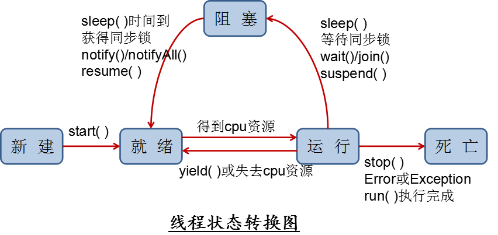

# 多线程

在现在这种高并发场景下，多线程的需求也越来越多，Java中的多线程，基本都是使用native方法调用系统的API完成系统的线程调度，Java在最大程度上帮我们简化了部分操作，但是线程安全这类问题还是由开发者自己解决。

现在使用多线程，大多数选择实现Runnable接口，之所以不选择继承Thread,是因为Java中是单继承，如果继承了Thread，那么有继承其他类的需求就无法实现，Java中是允许实现多接口的，所以大多数情况下选择实现Runnable接口；但是二者之间又有什么区别呢？

1. Java中的单继承机制限制，实现Runnable不会受到单继承限制
2. 继承Thread的方式共享数据比较方便，使用static方式，实现Runnable共享数据时，只需要共用同一个Runnable接口的实现
3. 继承Thread类的方式，在同步锁时，要么选择一个static对象作为锁，要么选择“classname.class”或者当前类的Class对象，实现Runnable接口时，同步锁可以直接锁this对象。

